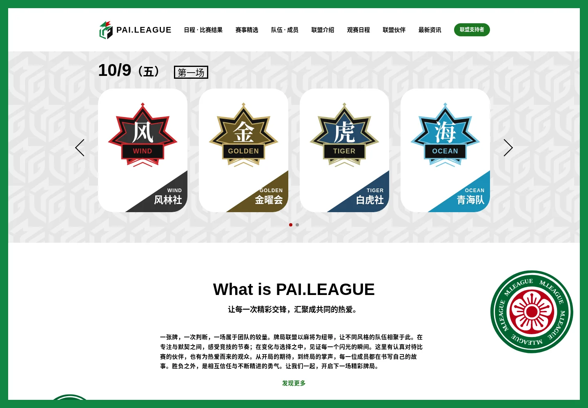
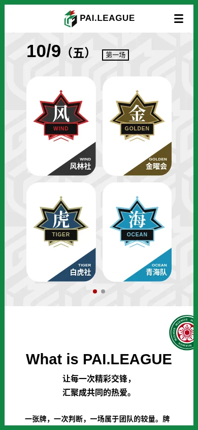

# MLeagueReconstruction

依据 [M.LEAGUE 首页](https://m-league.jp/)及前期设计分析实现的响应式麻将主题首页。

保留原站的绿色视口边框、灰色几何底纹、牌形轮播、介绍区、团队排名、四组个人榜、赛程、新闻、社交入口和黑色合作伙伴页脚。球队、成员、成绩、文案、新闻配图及合作伙伴标志均使用独立示例内容。花牌、鸟形装饰和底纹直接使用原站抓取的本地文件。

## 本地运行

需要 Node.js 20.19+ 或 22.12+。

```sh
npm ci
npm run dev
```

访问终端显示的本地地址。生产构建与预览：

```sh
npm run build
npm run preview
```

构建产物位于 `dist/`，可交给静态文件服务。Vite 使用相对资源路径，支持根路径和子目录部署。本仓库没有自动发布配置。

## 首页交互

- 轮播支持箭头、分页圆点、左右方向键和滑动；默认不自动播放。
- 桌面端每两组个人榜共同展开，手机端每张表独立展开。
- 手机导航支持遮罩、Esc、焦点循环及页内锚点。
- 赛程弹窗支持两轮结果、未来对阵、遮罩关闭、Esc 和手机内部滚动。
- 新闻、辅助信息及会员面板均在首页内展示，不创建跳转页面。
- 会员表单仅做本地格式验证，不发送、存储或认证账号信息。
- 花牌随滚动移动和旋转；系统设置减少动态效果时停用。

手机断点统一为 `max-width: 767px`。768px 以上使用适配窄屏的桌面布局，修正原站在该边界的菜单与布局判断不一致问题。

## 验证

```sh
npx playwright install chromium
npm test
```

`npm test` 先构建，再针对生产预览运行浏览器测试，覆盖完整页面、轮播、排行榜、导航、弹窗、内容展开、320–1440px 响应式、减少动态效果以及表单不提交凭据。

已有系统 Chromium 时可指定路径，例如：

```sh
PLAYWRIGHT_CHROMIUM_EXECUTABLE_PATH=/usr/bin/chromium npm test
```

## 设计与素材

- [实现说明](docs/design-notes.md)
- [装饰素材来源及校验值](docs/asset-sources.json)
- `public/assets/decor/`：原站装饰文件。
- `public/assets/news-*.svg`：本项目创建的示例新闻插画。
- `src/main.js`：示例数据、独立队伍图形、人物插画与交互。
- `src/styles.css`：版式、响应式及动态效果。

## 界面预览

桌面首屏：



手机首屏：



[桌面完整页面](docs/desktop-full.webp) · [手机完整页面](docs/mobile-full.webp)
